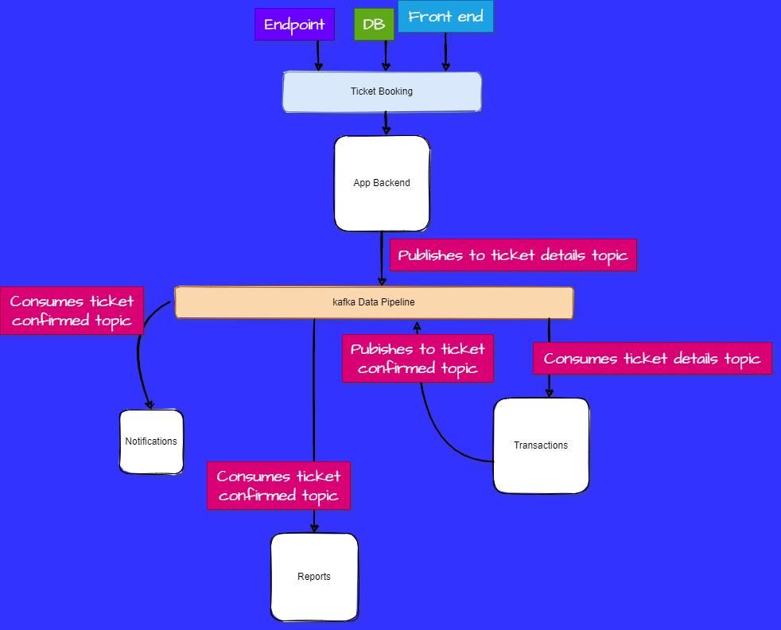

# Ticket_Booking

This is an event driven scalable application that relies on Kafka to stream data. It demonstrates how data can be obtained from a frontend or any other source, published into data pipeline from which other modules/applications/services can read from simultaneously.

## Stream Flow

## Kafka Topics

### a. Ticket_details

A category of messages that records published by App_backend(producer). It is from this topic that such consumers as transactions reads from.

### b. Ticket_confirmed

This topic holds logs published to it by transaction service. It records ticket-confirmed details. Reports and notification service consume messages from this topic.

## Services

There are four services that interact with the kafka data pipeline on different topics.

### a. App_backend

It picks data from frontend/endpoint and formats it with user details before writing it to a kafka topic called ticket_details. The process entails checking that data conforms with predertimed payload fomats.

### b. Transactions

Transactions service is also subscribed to ticket_details topic. It reads messages stored in the topic, checks the individual messages for such details as name, payment deatils and to & fro deatils. Once processed, the service writes back to kafka topic ticket_confirmed. This topic encapsulates data about confirmed ticket.

### c. Reports

Reports service reads and utilizes data from ticket_confirmed topic and generates analytic data such as number of tickets created and confirmed as well revenue generated.

### d. Notification

Once ticket creation has been confirmed, the notification service reads from ticket_confirmed and sends an email notification to the passenger.

## Docker

In order to deliver seamless service and manage the data pipeline architecture, kafka cluster and zookeeper server have been packaged into a dockerized conteiner. In this developemt, docker enabled version control to the app.
